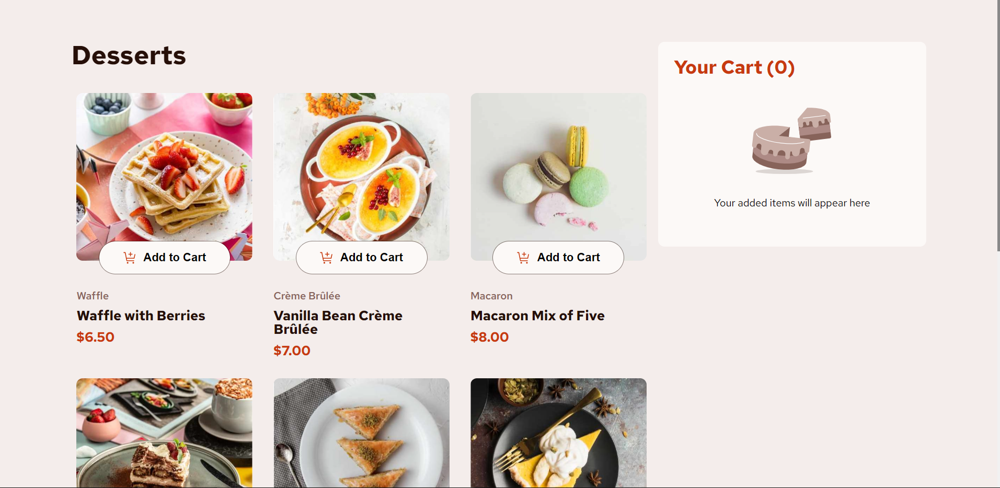

Here's a refined version of your README template with React removed and a focus on vanilla JavaScript:

---

# Frontend Mentor - Product List with Cart Solution

This is a solution to the [Product List with Cart challenge on Frontend Mentor](https://www.frontendmentor.io/challenges/product-list-with-cart-5MmqLVAp_d). This challenge helps you practice adding a cart feature and managing product quantity on a website.

## Table of Contents

- [Frontend Mentor - Product List with Cart Solution](#frontend-mentor---product-list-with-cart-solution)
  - [Table of Contents](#table-of-contents)
  - [Overview](#overview)
    - [The Challenge](#the-challenge)
    - [Screenshot](#screenshot)
    - [Links](#links)
  - [Process](#process)
    - [Built With](#built-with)
    - [What I Learned](#what-i-learned)
    - [Continued Development](#continued-development)
    - [Useful Resources](#useful-resources)
  - [Author](#author)
  - [Acknowledgments](#acknowledgments)

## Overview

### The Challenge

Users should be able to:

- Add items to the cart and remove them
- Increase or decrease the number of items in the cart
- See an order confirmation modal when they click "Confirm Order"
- Reset their selections by clicking "Start New Order"
- View optimal layout for their device screen size
- See hover and focus states for all interactive elements

### Screenshot



### Links

- [Solution URL](https://github.com/sudarshanHosalli/Product-List-with-Cart)
- [Live Site URL](https://statuesque-gecko-372bf4.netlify.app/)

## Process

### Built With

- Semantic HTML5 markup
- CSS custom properties
- Flexbox and CSS Grid
- Mobile-first workflow
- Vanilla JavaScript

### What I Learned

This project reinforced the following skills:

- Building a shopping cart from scratch using vanilla JavaScript
- Managing cart state with localStorage to persist cart data
- Dynamically updating UI elements based on user interactions

Here’s a sample of some JavaScript code I used:

```js
function addToCart(product) {
  // Logic to add product to cart
}

// Function to calculate total cart price
function calculateTotal() {
  return cart.reduce((total, item) => total + item.price * item.quantity, 0);
}
```

### Continued Development

Moving forward, I would like to continue improving my skills in:

- Optimizing JavaScript for better performance
- Improving accessibility with ARIA attributes
- Refining mobile responsiveness for more seamless cross-device experience

### Useful Resources

- [MDN Web Docs - localStorage](https://developer.mozilla.org/en-US/docs/Web/API/Window/localStorage) - Helpful for storing and retrieving cart data.
- [CSS-Tricks - A Complete Guide to Flexbox](https://css-tricks.com/snippets/css/a-guide-to-flexbox/) - Great for structuring responsive layouts.

## Author

- Frontend Mentor - [@sudarshanHosalli](https://www.frontendmentor.io/profile/sudarshanHosalli)
- GIthub - [sudarshanHosalli](https://github.com/sudarshanHosalli)

## Acknowledgments

Thanks to the Frontend Mentor community for providing inspiration and feedback.

--- 